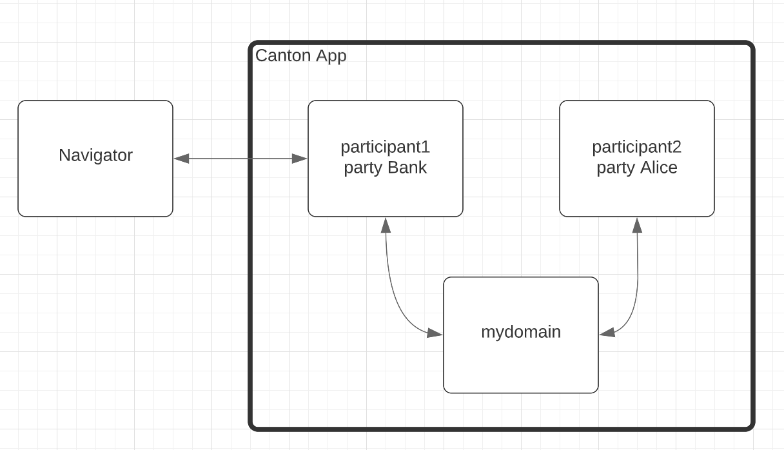
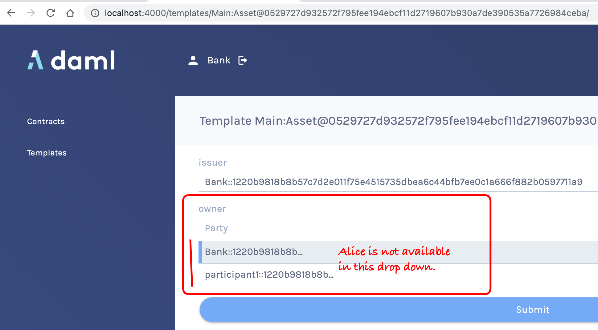

# Navigator Non-local Parties Demo

This code demonstrates a bug. Navigator does not list the non-local parties in Party dropdown fields.

## Demo Topology



## Demo Steps

1. Install Daml SDK, 2.4.2.

1. Install Canton Open Source, 2.4.2.

1. Run `daml new navigator-non-local-parties`

1. `cd navigator-non-local-parties`

1. Run `daml build`

1. Run `daml studio`

1. In daml.yaml, comment out `init-script: Main:setup`

1. In daml.yaml, append the following:  
   ```
   navigator-options:
    - --feature-user-management=false
   ```

1. Create canton.conf and bootstrap.canton files

1. Run `../../../digital-asset/canton-open-source-2.4.2/bin/canton --config canton.conf --bootstrap bootstrap.canton`

1. Run `daml navigator server -c ui-backend-participant1.conf --feature-user-management false localhost 5011`

1. Browse to `http://localhost:4000`

1. Login as a Bank.

1. Try to create a `Main:Asset` contract.

1. For `issuer`, select the Bank.

**Expected Behavior**

When selecting the `owner` field, the dropdown box includes all parties in the domain, including Alice.

**Actual Behavior**

When selecting the `owner` field, the dropdown box does not include Alice.



**Impact**

Navigator is extremely limited in its ability to demonstrate Canton.

**Workaround**

Using a Canton Console, you can get a reference to the `Alice` party, call `alice.toProtoPrimitive` and then paste the resulting string into the Navigator field.